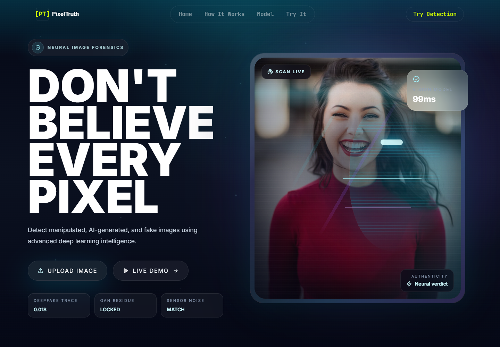
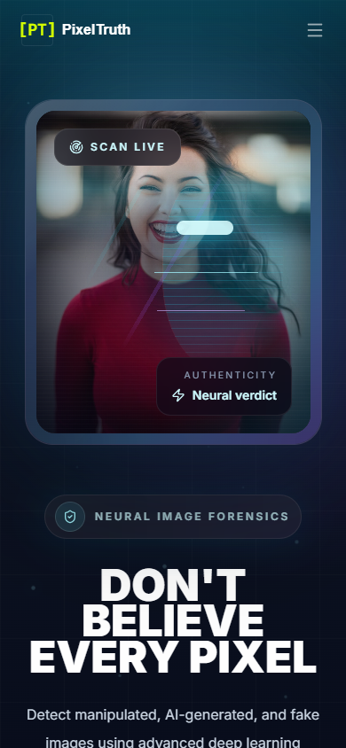
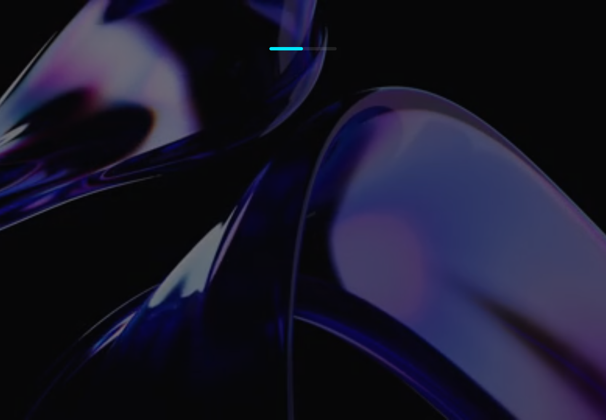

# deepfake-image-detector

<p align="center">
  <strong>VeriSight</strong><br />
  Production-ready AI image authenticity scanner for detecting manipulated, synthetic, and deepfake imagery.
</p>

<p align="center">
  Full-stack React + FastAPI application with premium glassmorphism UI, upload/webcam/URL ingestion, and ConvNeXt-based inference.
</p>

## Overview

VeriSight helps users inspect whether an image is authentic or AI-generated through a fast, visually polished workflow. The project pairs a cinematic frontend with a FastAPI inference service, exposes prediction and analytics endpoints, and is packaged for clean local development plus container deployment.

## Problem Statement

Synthetic images are increasingly hard to distinguish from authentic photography. Newsrooms, researchers, creators, and hiring teams need fast tooling that can surface authenticity signals without requiring ML expertise. VeriSight provides that workflow in a deployable product format.

## Key Features

- Premium React/Vite frontend with animated hero, glassmorphism cards, and responsive sections
- Image analysis from file upload, webcam capture, and remote image URL
- FastAPI backend with prediction, scan history, confidence distribution, and timeline endpoints
- Checkpoint loading through `MODEL_PATH` or runtime download through `MODEL_URL`
- Container-ready deployment flow for Render plus static frontend hosting on Vercel or Netlify
- Cleaner repository structure with docs, scripts, CI, and environment templates

## Screenshots

### Desktop



### Mobile



### Result modal



## Tech Stack

- Frontend: React 19, Vite 8, Tailwind CSS 4, Framer Motion
- Backend: FastAPI, Uvicorn, PyTorch, TorchVision, Pillow
- Model: ConvNeXt-based binary classifier for real vs synthetic image detection
- Deployment: Docker, Render, Vercel/Netlify

## Repository Structure

```text
deepfake-image-detector/
├── backend/
│   ├── main.py
│   ├── requirements.txt
│   ├── run.bat
│   └── run.sh
├── docs/
│   ├── DEPLOYMENT.md
│   └── screenshots/
├── frontend/
│   ├── public/
│   ├── src/
│   ├── .env.example
│   ├── package.json
│   └── vite.config.js
├── scripts/
│   ├── start-dev.ps1
│   └── start-dev.sh
├── training/
│   └── train.py
├── .dockerignore
├── .env.example
├── .gitignore
├── app.py
├── Dockerfile
├── LICENSE
├── README.md
├── render.yaml
└── requirements.txt
```

## API Surface

| Endpoint | Method | Purpose |
| --- | --- | --- |
| `/predict` | `POST` | Compatibility prediction endpoint |
| `/api/predict` | `POST` | Primary prediction endpoint |
| `/api/scans` | `GET/POST` | List prior scans or create a new scan |
| `/api/stats` | `GET` | Aggregate scan statistics |
| `/api/stats/timeseries` | `GET` | Daily trend data |
| `/api/stats/confidence` | `GET` | Confidence bucket distribution |
| `/health` | `GET` | Runtime health and model status |

## Run Locally

### 1. Backend

```bash
python -m venv .venv
.venv\Scripts\activate
pip install -r requirements.txt
copy .env.example .env
python -m uvicorn app:app --reload --host 127.0.0.1 --port 8000
```

### 2. Frontend

```bash
cd frontend
npm install
copy .env.example .env
npm run dev
```

### 3. One-command helpers

- PowerShell: `./scripts/start-dev.ps1`
- Bash: `./scripts/start-dev.sh`

## Environment Variables

| Variable | Purpose |
| --- | --- |
| `MODEL_PATH` | Local checkpoint path |
| `MODEL_URL` | Downloadable checkpoint URL for deployment |
| `CORS_ALLOW_ORIGINS` | Allowed frontend origins |
| `FRONTEND_DIST_DIR` | Built frontend directory served by FastAPI |
| `SCAN_STORE_PATH` | Runtime location for saved scan history |

## Deployment

- Backend blueprint: [docs/DEPLOYMENT.md](docs/DEPLOYMENT.md)
- Recommended repo name: `deepfake-image-detector`
- Current repository can be renamed in GitHub settings without changing the local code layout

## Future Improvements

- Add model explainability overlays and saliency maps
- Introduce authenticated scan history for teams
- Add automated evaluation reports and benchmark dashboards
- Support batched uploads and drag-and-drop folders

## Author

Built and productionized for a professional GitHub portfolio presentation around AI image forensics.

## License

This project is released under the MIT License. See [LICENSE](LICENSE).
